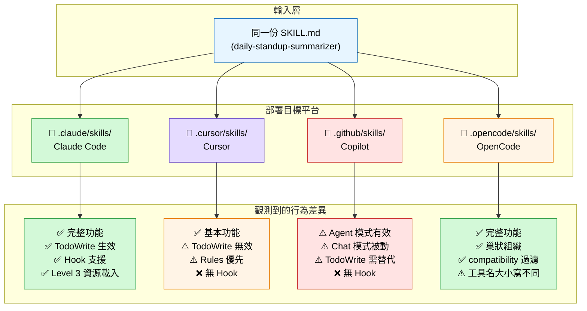
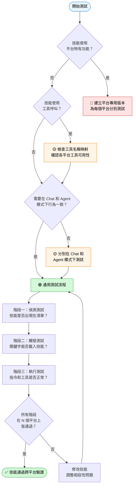

# Chapter 6: 跨平台測試與相容性

## 學習目標

完成本章後，你將能夠：

1. 解釋為什麼同一個 SKILL.md 在不同 Agent 平台上可能產生不同行為
2. 列出目前支援 Agent Skills 格式的主要平台及其技能目錄路徑
3. 建立可跨平台執行的通用技能
4. 設計一套跨平台測試流程來驗證技能行為一致性
5. 判斷何時該建立平台專用技能、何時該維持通用設計
6. ⚠️ 辨識常見的跨平台相容性陷阱（路徑差異、工具命名差異、執行環境差異）

---

## 6.1 為什麼跨平台相容性是必須面對的問題

你可能已經體會到：在 Claude Code 完美運作的技能，放到 Cursor 就「讀不到」；在 Copilot 能夠自動觸發的技能，搬到 Gemini CLI 卻毫無反應；在 OpenCode 用了好一陣子的 `compatibility: opencode` 標記，上傳到 agentskills.io 後卻被其他平台的使用者反映「技能根本沒載入」。這不是 Bug，這是生態系多樣性的必然結果。

Agent Skills 之所以稱為「開放格式」，就是因為它**不被任何單一平台綁定**。截至 2026 年中，agentskills.io 上列出的相容平台超過 30 個，包括：

- Claude Code（Anthropic）
- Cursor（Anysphere）
- GitHub Copilot（Microsoft）
- Amazon Codex（AWS）
- Gemini CLI（Google）
- OpenCode（開源社群）
- Continue.dev（開源）
- Windsurf（Codeium）
- 以及其他新興工具

但「相容」不代表「表現一致」。**同一份 SKILL.md，在不同 Agent 眼中可能完全是不同的東西。**

這對技能作者意味著什麼？如果你只在自己慣用的平台上測試技能，就無法保證它在其他平台上也能正常運作。而 Agent Skills 的核心價值——跨平台可攜性——正是建立在「一次編寫，到處執行」的承諾之上。如果做不到跨平台相容，那 Skills 跟平台專屬的 Plugin 就沒有本質區別了。

### 為什麼會這樣？

| 因素 | 影響 | 具體案例 |
|------|------|----------|
| **目錄結構不同** | 每個平台規定的技能放置路徑不同 | `.claude/` vs `.cursor/` vs `.github/` — 放錯目錄直接等於技能不存在 |
| **載入機制不同** | 有些平台永遠載入所有技能，有些按需載入 | Cursor 的 Rules 永遠載入，Skills 按需觸發，兩者行為完全不同 |
| **中繼資料（Metadata）解讀不同** | `compatibility`、`allowed-tools` 等欄位並非每個平台都支援 | OpenCode 會用 `compatibility` 過濾技能，其他平台完全忽略 |
| **工具映射不同** | 同一操作在不同平台叫不同名稱 | `TodoWrite` 在 Claude Code 有效，在 Gemini CLI 無對應工具 |
| **觸發邏輯不同** | Description 的匹配演算法每個平台實作不同 | Copilot Chat 模式需要精確關鍵字，Claude Code 支援語意模糊匹配 |

這就像同一份食譜（SKILL.md），交給不同國家的廚師（Agent 平台），他們會用不同的工具、不同的爐具、不同的食材來烹調——結果自然不同。作為食譜作者，你必須知道你的讀者站在什麼樣的廚房裡。

### 真實世界的痛點

一位從 Claude Code 轉移到 Copilot 的開發者曾反映：「我的 code-review 技能在 Claude Code 上用了三個月都沒問題，換到 Copilot 後，技能完全不會觸發。我花了兩天才發現，原來是 Copilot Chat 模式對 description 的匹配更嚴格，『Review code for best practices』這種模糊描述不夠精確，必須改成『Code review for security, performance, and maintainability. Trigger when user says: review my code』才能正常運作。」

這不是特例——跨平台差異是每一位技能作者遲早會撞上的牆。

---

## 6.2 支援平台總覽

截至 2026 年中，以下平台被視為 Agent Skills 的「一級支援」平台。我們逐一檢視它們的技能載入機制。

### 6.2.1 Claude Code

- **技能目錄**：`.claude/skills/`（專案層級） + `~/.claude/skills/`（全域層級）
- **載入方式**：啟動時掃描所有 SKILL.md 的 frontmatter，將 `name` 和 `description` 載入中繼資料索引。當使用者提問觸發匹配時，才載入完整內容。
- **三層揭露**：完整支援 Level 1 → Level 2 → Level 3
- **工具映射**：使用 `TodoWrite`、`Task`、`Read`、`Write`、`Edit` 等內建工具
- **特有機制**：支援 hooks（pre/post 鉤子，見 6.8 節）
- **版本**：最早支援 Agent Skills 的平台之一，生態成熟度最高
- **注意事項**：Claude Code 是 Anthropic 的產品，技能行為會隨著 Claude 模型版本更新而變化。同一份技能在 Claude 3.5 Sonnet 和 Claude 4 Opus 上的執行效果可能不同。

### 6.2.2 Cursor

- **技能目錄**：`.cursor/skills/`（留意：`.cursor/` 而非 `.claude/`）
- **載入方式**：類似 Claude Code，但 Cursor 更強調 `.cursor/rules/` 作為補充機制
- **⚠️ 關鍵差異**：Cursor 同時有「Rules」和「Skills」兩套系統。Rules 是 `.cursor/rules/` 下的 `.mdc` 檔案，永遠載入；Skills 則依賴觸發。
- **特有機制**：Rules + Skills 雙軌並行（見 6.7 節）
- **使用者須知**：如果你同時使用 Rules 和 Skills，要注意兩者之間的優先順序。預設情況下，Rules 的內容優先於 Skills。

### 6.2.3 GitHub Copilot

- **技能目錄**：`.github/skills/`
- **載入方式**：Copilot 在 Chat 模式和 Agent 模式中對 Skills 的支援程度不同。Agent 模式下 Skills 觸發較積極，Chat 模式下較被動。
- **⚠️ 模式差異**：Copilot 的 Chat 模式（問答為主）和 Agent 模式（可執行程式碼）對 Skills 的處理方式不同，測試時必須兩種模式都驗證。
- **特有機制**：與 GitHub Marketplace 整合，可發布技能到組織層級。企業版的 Copilot 還能將 Skills 部署到整個組織。
- **版本注意**：GitHub Copilot 的技能支援仍在快速演進中，不同 VS Code 擴充功能版本的行為可能不同。

### 6.2.4 Amazon Codex（前 CodeWhisperer）

- **技能目錄**：`.agents/skills/`（Codex CLI 的規範目錄）
- **載入方式**：自動偵測專案根目錄下的 `.agents/` 資料夾。Codex CLI 的啟動流程會掃描該目錄下的所有 SKILL.md。
- **⚠️ 注意**：Codex 是 AWS 生態的一環，技能中的工具呼叫（Tool Calling）若涉及 AWS API（如 S3、Lambda），會有額外的 IAM 權限模型需要處理。你的技能可能需要提示使用者先設定 AWS 憑證。
- **優勢**：與 Amazon Bedrock 和 SageMaker 深度整合，適合需要调用 AWS 服務的技能

### 6.2.5 Gemini CLI

- **技能目錄**：`.gemini/skills/` 或透過 `activate_skill` 工具動態載入
- **載入方式**：Gemini CLI 使用不同的技能啟用機制——技能需要透過專用工具（`activate_skill`）明確啟用，而非自動掃描。這意味著 Gemini CLI 的使用者需要知道技能的名稱才能手動啟用它。
- **⚠️ 工具映射**：Gemini CLI 的工具命名與 Claude Code 明顯不同。例如 `TodoWrite` 在 Gemini 中可能對應不同的語法，或者根本沒有對應工具。撰寫 Gemini CLI 專用技能時，需要查閱 Gemini CLI 的工具參考文件。
- **模型整合**：Gemini CLI 使用 Google 的 Gemini 模型，技能指令的風格可能需要調整以符合 Gemini 的提示習慣。

### 6.2.6 OpenCode

- **技能目錄**：`.opencode/skills/`（支援巢狀組織，如 `skills/category/skill-name/`）
- **載入方式**：使用 `skill` 工具載入，類似 Claude Code 的觸發機制（Trigger Mechanism）。技能作者可以利用 `skill` 工具來載入其他技能，實現技能組合。
- **compatibility 欄位**：OpenCode 原生支援 `compatibility: opencode` 標記，用於標示該技能僅在 OpenCode 環境中有效。這是目前唯一有實作 `compatibility` 過濾機制的平台。
- **特有機制**：支援 `plugins/`、`commands/`、`tools/` 等擴充目錄結構，與 Skills 形成完整的生態系統。在 OpenCode 上，技能可以與 Plugin 和 Tool 互相配合。
- **巢狀組織**：OpenCode 是唯一支援巢狀技能目錄的平台（如 `.opencode/skills/category/subcategory/skill-name/`），其他平台只接受扁平結構。

---

## 6.3 目錄路徑差異對照表

這可能是跨平台相容性**最常出錯**的地方——放錯目錄，技能直接「不存在」。

| 平台 | 技能目錄路徑（專案層級） | 全域層級路徑 |
|------|--------------------------|-------------|
| Claude Code | `.claude/skills/` | `~/.claude/skills/` |
| Cursor | `.cursor/skills/` | `~/.cursor/skills/` |
| Copilot | `.github/skills/` | 無（僅專案層級） |
| Codex CLI | `.agents/skills/` | `~/.agents/skills/` |
| Gemini CLI | `.gemini/skills/` | `~/.gemini/skills/` |
| OpenCode | `.opencode/skills/` | `~/.config/opencode/skills/` |

> **實戰建議**：如果你的技能需要跨平台使用，考慮在專案根目錄下**同時建立多個符號連結**（symlink），或使用建置腳本自動複製到所有目錄。但要注意版本同步問題——五個目錄裡有五份副本，更新時容易遺漏。

⚠️ **實驗性建議**：agentskills.io 團隊正在討論「統一入口路徑」規範，但目前尚未定案。在此之前，各平台各自為政的狀態還會持續。

---

## 6.4 已知行為差異

以下差異是跨平台測試時最常遇到的「驚喜」：

### 6.4.1 觸發敏感度

不同平台對 `description` 的匹配邏輯不同：

- **Claude Code**：匹配較寬鬆，部分語意匹配也會觸發
- **Copilot Agent 模式**：觸發門檻適中
- **Copilot Chat 模式**：觸發門檻較高，需要更精確的關鍵字匹配
- **OpenCode**：匹配邏輯接近 Claude Code，但對 `compatibility` 欄位的過濾更嚴格

### 6.4.2 中繼資料欄位支援度

| 欄位 | Claude Code | Copilot | Cursor | OpenCode | Gemini CLI |
|------|:-----------:|:-------:|:------:|:--------:|:----------:|
| `name` | ✅ | ✅ | ✅ | ✅ | ✅ |
| `description` | ✅ | ✅ | ✅ | ✅ | ✅ |
| `license` | ✅ | ⚠️ 部分 | ❌ 忽略 | ✅ | ⚠️ 部分 |
| `compatibility` | ❌ 忽略 | ❌ 忽略 | ❌ 忽略 | ✅ 過濾 | ❌ 忽略 |
| `allowed-tools` | ⚠️ 實驗性 | ❌ | ❌ | ⚠️ 實驗性 | ❌ |
| `metadata` | ✅ | ⚠️ 部分 | ⚠️ 部分 | ✅ | ❌ |

### 6.4.3 工具命名差異

同一操作在不同平台的工具名稱：

| 概念 | Claude Code | OpenCode | Gemini CLI |
|------|------------|----------|------------|
| 待辦事項 | `TodoWrite` | `todowrite` | ⚠️ 需查對應文件 |
| 子任務分派 | `Task` | 子代理系統 | 暫不支援 |
| 讀取檔案 | `Read` | 對應原生讀取 | `read` |
| 寫入檔案 | `Write` | 對應原生寫入 | `write` |
| 編輯檔案 | `Edit` | 對應原生編輯 | `edit` |

> **關鍵教訓**：如果你的 SKILL.md 中寫了「使用 TodoWrite 建立待辦清單」，它在 Gemini CLI 上可能**完全不會執行**，因為 Gemini 根本沒有這個工具。

---

## 6.5 測試方法論

跨平台測試不是「順便做」的事——它需要一套系統化的流程。如果你的技能要在 N 個平台上使用，請至少在 N-1 個你「不常用」的平台上測試過。

### 六步測試法

這是一個經實證有效的標準流程：

```
Step 1: 定義測試案例
   │  列出你要驗證的核心行為（至少 3 個案例）
   │
Step 2: 建立測試技能（最小可行版本）
   │  只包含你要測試的功能，排除不相關的指令
   │
Step 3: 在平台 A 上測試 ✅/❌
   │  記錄載入、觸發、執行三個階段的結果
   │
Step 4: 在平台 B 上測試 ✅/❌
   │   使用相同的測試案例
   │
Step 5: 在平台 C 上測試 ✅/❌
   │   觀察累積的行為模式差異
   │
Step 6: 記錄差異 → 調整 → 重新測試
       必要時回到 Step 2 修改技能
```

### 測試的三個階段

跨平台測試不是一個「有或沒有」的二元問題。同一個技能在同一個平台上，有三個不同的測試階段：

**階段一：偵測（Discovery）**
平台是否掃描到了你的技能？用 `skills list`、`/skills` 或平台對應的指令檢查技能名稱是否出現在中繼資料清單中。

**階段二：觸發（Triggering）**
當使用者說出（或寫出）觸發關鍵字時，技能的自動載入機制是否正常運作？這是最容易出問題的環節——description 寫得再好，匹配演算法不買單也沒用。

**階段三：執行（Execution）**
技能載入後，裡面的指令是否被正確執行？如果技能包含工具呼叫（TodoWrite、Task 等），這些工具在目標平台上是否存在？

### 測試技能範例（最小驗證用）

建立一個名為 `test-cross-platform` 的極簡技能，只做一件事——在當前目錄產生一個標記檔案：

```markdown
---
name: test-cross-platform
description: Test skill for cross-platform compatibility verification. Create a marker file when triggered.
license: MIT
---

# Test Cross-Platform

## What This Does

This skill exists only to verify that the platform can load and execute skills.

## Action

Create a file named `cross-platform-test-passed.txt` in the current directory with the content:
"Platform: [platform name] | Agent Skills: loaded | Timestamp: [current time]"
```

然後依序在三個平台上觸發關鍵字「test cross-platform」、「create marker file」，記錄結果。

### 測試記錄表格

建議使用以下格式記錄測試結果：

| 測試項目 | Claude Code | Copilot (Agent) | Copilot (Chat) | OpenCode |
|---------|:-----------:|:---------------:|:--------------:|:--------:|
| 技能被偵測 | ✅ 出現於清單 | ✅ 出現於清單 | ✅ 出現於清單 | ✅ 出現於清單 |
| 關鍵字「test」觸發 | ✅ | ✅ | ⚠️ 未觸發 | ✅ |
| 關鍵字「cross-platform」觸發 | ✅ | ✅ | ✅ | ✅ |
| 檔案成功建立 | ✅ | ✅ | ❌ 無檔案寫入權限 | ✅ |
| 檔案內容正確 | ✅ | ✅ | N/A | ✅ |
| 執行時間 | 2 秒 | 3 秒 | — | 1 秒 |

> 這個表格本身也是一個有用的測試工具——當你需要在多個平台間反覆測試時，標準化的記錄格式能幫助你快速比對。

### 測試核對表

- [ ] 技能是否能被正確偵測？（`skills list` 或類似指令看得到嗎？）
- [ ] 觸發關鍵字後，技能是否被載入？
- [ ] 技能的指令是否被正確執行？
- [ ] 如果技能包含檔案操作，檔案是否被正確建立？
- [ ] 如果技能包含外部工具呼叫，工具是否正常運作？
- [ ] ⚠️ 技能的 format 輸出是否在不同平台一致？
- [ ] ⚠️ 技能中的工具名稱是否需要為特定平台修改？
- [ ] ⚠️ 技能在 Chat 模式和 Agent 模式下的行為是否相同？

---

## 6.6 Copilot 特有：Chat 模式 vs Agent 模式

GitHub Copilot 是少數**同一平台兩種技能行為**的案例。如果你只在一種模式下測過，另一種模式可能會讓你措手不及。

### Chat 模式

- Skills 觸發頻率較低
- 偏向回答問題而非執行程式碼
- ⚠️ 某些工具指令（如檔案寫入）可能被限制

### Agent 模式

- 技能觸發更積極
- 可執行多步驟工作流程
- 支援工具呼叫的完整鏈路

### 實戰建議

如果你的技能包含**檔案操作**或**外部工具呼叫**，務必在 Agent 模式下測試——Chat 模式可能無法完整執行。如果你的技能純粹是**知識提供**（參考資料、編碼規範），Chat 模式就足夠了。

---

## 6.7 Cursor 特有：Rules vs Skills

Cursor 的雙軌系統是新手最容易混淆的地方。

### Rules（`.cursor/rules/*.mdc`）

- **永遠載入**：類似「全域指令」，每次對話都自動帶入
- **適合**：編碼規範、專案約定、架構決策
- **限制**：檔案格式較嚴格，使用 `.mdc` 副檔名

### Skills（`.cursor/skills/*/SKILL.md`）

- **按需載入**：只有觸發時才載入
- **適合**：特定工作流程、複雜自動化任務
- **優勢**：標準 Agent Skills 格式，跨平台相容

### 選擇指南

| 想做的事 | 選 Rules | 選 Skills |
|---------|:--------:|:---------:|
| 永遠執行的編碼規範 | ✅ | ❌ |
| 偶爾觸發的複雜任務 | ❌ | ✅ |
| 跨平台通用 | ❌ | ✅ |
| 專案層級設定 | ✅ | ⚠️ 也可 |

> **Cursor 使用者的建議**：當你需要全域行為時用 Rules，需要工作流程封裝時用 Skills。兩者可以互相引用——在 Rules 中提示「當使用者提到 X 時，參考 skills/X 的內容」。

---

## 6.8 Claude Code 特有：Hook 系統

Claude Code 是最早支援 Agent Skills 的平台之一，也是功能最完整的。它的 Hook 系統是重要特色。

### Hook 類型

- **Pre-hooks**：在特定動作前執行
- **Post-hooks**：在特定動作後執行

### 與 Skills 的互動

Skills 可以聲明需要使用哪些 Hook，例如：

```yaml
# 在 SKILL.md 的 frontmatter
hooks:
  pre-commit: scripts/validate-skill.sh
  post-publish: scripts/notify-publish.sh
```

⚠️ **注意**：Hook 支援目前仍是 Claude Code 特有的功能。如果你在 SKILL.md 中使用了 `hooks` 欄位，其他平台很可能會忽略它。這不會造成錯誤，但也不會生效。

---

## 6.9 真實案例：一次跨平台相容性問題的完整除錯過程

為了幫助你更具體地理解跨平台相容性問題，以下是我們在開發一個技能時遇到的真實案例。

### 情境

我們建立了一個名為 `daily-standup-summarizer` 的技能，功能是：從團隊的 Slack 或 Discord 對話中提取關鍵訊息，自動產生每日站立會議摘要。

### 技能核心指令（簡化版）

```markdown
---
name: daily-standup-summarizer
description: Summarize team chat messages into daily standup format. Extract blockers, progress, and plans.
---

# Daily Standup Summarizer

## Workflow

1. Ask the user to paste today's chat messages
2. Use `TodoWrite` to create a checklist of team members
3. Categorize each message into: `[Progress]`, `[Blocker]`, `[Plan]`
4. Output a formatted standup summary using `Edit` to write to a file
```

### 問題

這個技能在 Claude Code 上完美運作。但有位使用 Copilot Agent 模式的團隊成員回報：「技能有載入，但執行到一半就停了。」

### 除錯過程

| 問題 | 根因 | 解決方案 |
|------|------|----------|
| `TodoWrite` 在 Copilot 上無法建立 checklist | Copilot Agent 模式的工具名稱不同 | 在技能中加入備註：「If running on Copilot, use the built-in task list feature instead of TodoWrite」 |
| Copilot Chat 模式下完全不執行步驟 2-4 | Chat 模式不支援多步驟工具呼叫 | 在 description 中加入「Use in Agent mode for full functionality」 |
| 技能在 Cursor 上偵測不到 | 技能放在 `.claude/skills/` 而非 `.cursor/skills/` | 在專案根目錄建立 `.cursor/skills/` 的符號連結 |

### 教訓

1. **不要假設工具在各平台都存在**——`TodoWrite` 只是其中一個例子
2. **description 要提示模式需求**——如果技能需要 Agent 模式，直接在 description 中寫明
3. **路徑問題最容易被忽略**——檢查技能目錄是否正確，這是最基本但也最常見的錯誤

---

## 6.10 平台相容性完整對照表

以下表格統整各平台對 Agent Skills 核心功能的支援程度：

| 功能特性 | Claude Code | Copilot | Cursor | Codex CLI | Gemini CLI | OpenCode |
|---------|:-----------:|:-------:|:------:|:---------:|:----------:|:--------:|
| Level 1 中繼資料載入 | ✅ | ✅ | ✅ | ✅ | ✅ | ✅ |
| Level 2 完整內容載入 | ✅ | ✅ | ✅ | ✅ | ✅ | ✅ |
| Level 3 資源檔案 | ✅ | ⚠️ 部分 | ⚠️ 部分 | ⚠️ 部分 | ⚠️ 部分 | ✅ |
| 全域技能目錄 | ✅ | ❌ | ✅ | ✅ | ✅ | ✅ |
| description 觸發 | ✅ | ✅ | ✅ | ✅ | ✅ | ✅ |
| `compatibility` 過濾 | ❌ | ❌ | ❌ | ❌ | ❌ | ✅ |
| `allowed-tools` | ⚠️ | ❌ | ❌ | ❌ | ❌ | ⚠️ |
| 工具映射 | Claude 原生 | Copilot 原生 | Cursor 原生 | Codex 原生 | Gemini 原生 | OpenCode 原生 |
| Hook 系統 | ✅ | ❌ | ❌ | ❌ | ❌ | ❌ |
| Rules/技能雙軌 | ❌ | ❌ | ✅ | ❌ | ❌ | ❌ |
| Chat/Agent 模式差異 | ❌ 單一模式 | ✅ 兩種模式 | ⚠️ 略有差異 | ❌ 單一模式 | ✅ 兩種模式 | ❌ 單一模式 |
| 符號連結支援 | ✅ | ⚠️ | ✅ | ✅ | ✅ | ✅ |
| 巢狀技能目錄 | ❌ 扁平 | ❌ 扁平 | ❌ 扁平 | ❌ 扁平 | ❌ 扁平 | ✅ |

---

## 6.11 [DIAGRAM: 同一 SKILL.md 部署到四種 Agent 的行為差異]



**圖 6-1 說明**：同一份 `daily-standup-summarizer` SKILL.md 被複製到四個平台後的行為差異。Claude Code 和 OpenCode 完整支援；Cursor 因缺少 TodoWrite 而功能受限；Copilot 在 Chat 模式下幾乎無法執行多步驟工具流程。

## 6.12 [DIAGRAM: 跨平台測試流程決策樹]



**圖 6-2 說明**：跨平台測試的決策流程。從最關鍵的問題開始——是否使用平台特有功能。一路向下，最後通過三個階段的測試來驗證技能。

---

## 6.13 實戰技巧：多平台技能部署自動化

既然跨平台部署的最大痛點是「把技能放到正確的目錄」，我們當然可以用工具來解決這個問題。

### 選項一：符號連結（最簡單）

```powershell
# Windows PowerShell — 為同一個技能目錄建立跨平台符號連結
# 以系統管理員身分執行
New-Item -ItemType Junction -Path ".claude\skills\my-skill" -Target "skills\my-skill"
New-Item -ItemType Junction -Path ".cursor\skills\my-skill" -Target "skills\my-skill"
New-Item -ItemType Junction -Path ".opencode\skills\my-skill" -Target "skills\my-skill"
```

```bash
# Linux/macOS — 使用符號連結
ln -sf ../../skills/my-skill .claude/skills/my-skill
ln -sf ../../skills/my-skill .cursor/skills/my-skill
ln -sf ../../skills/my-skill .opencode/skills/my-skill
```

⚠️ **注意**：Windows 上的符號連結需要管理員權限或開發者模式。如果不方便，可以考慮選項二或三。

### 選項二：同步腳本（跨平台相容）

建立一個 `sync-skills.ps1`（PowerShell）或 `sync-skills.sh`（Bash）腳本：

```powershell
# sync-skills.ps1
$sourceDir = "skills"
$targets = @(".claude", ".cursor", ".github", ".opencode")

foreach ($target in $targets) {
    $targetPath = "$target\skills"
    if (-not (Test-Path $targetPath)) {
        New-Item -ItemType Directory -Path $targetPath -Force | Out-Null
    }
    Copy-Item -Path "$sourceDir\*" -Destination $targetPath -Recurse -Force
    Write-Host "✅ Synced to $targetPath"
}
```

### 選項三：Makefile（跨平台開發團隊適用）

```makefile
# Makefile
SKILLS_DIR = skills
TARGETS = .claude/skills .cursor/skills .github/skills .opencode/skills

sync:
	@for target in $(TARGETS); do \
		mkdir -p $$target; \
		cp -r $(SKILLS_DIR)/* $$target/; \
		echo "✅ Synced to $$target"; \
	done

watch:
	@echo "Watching for changes in $(SKILLS_DIR)..."
	@while true; do \
		inotifywait -r -e modify,create,delete $(SKILLS_DIR); \
		make sync; \
	done

.PHONY: sync watch
```

### 選擇建議

| 方法 | 適合場景 | 學習成本 | 維護成本 |
|------|---------|---------|---------|
| 符號連結 | 個人開發、單一機器 | 低 | 低（一次設定） |
| 同步腳本 | 團隊協作、CI/CD 流程 | 中 | 中（腳本版本管理） |
| Makefile + Watch | 頻繁修改技能的作者 | 中高 | 低（自動同步） |

---

## 6.14 何時建立平台專用技能 vs 通用技能

這是技能作者最常問的問題之一。答案並非「永遠通用」或「永遠專用」，而是取決於你的技能需要用到多少平台特有功能。

### 優先考慮通用設計

如果你的技能只用到了**所有平台都支援**的功能（標準 frontmatter、description 觸發、文字指令），那麼你應該建立一個通用技能，放在所有平台都能讀取的位置。通用技能的好處顯而易見：

- **單一維護點**——改一份 SKILL.md，所有平台同步更新
- **較少測試負擔**——只要核心功能在一個平台驗證過，其他平台的行為大致可預測
- **生態系貢獻**——上傳到 agentskills.io 時，通用技能能被最多開發者使用

**通用技能特徵**：
- 只使用標準 frontmatter 欄位（name, description, license）
- 不依賴平台特有工具名稱（避免 TodoWrite、Task 等）
- 指令以純文字／自然語言為主
- 不使用 Hook 或其他平台專屬機制
- description 使用廣泛可理解的觸發詞

### 何時需要平台專用技能

| 情境 | 建議 | 原因 |
|------|------|------|
| 需要使用 Hook 系統 | 建立 Claude Code 專用版本 | Hook 是 Claude Code 獨有功能 |
| 需要利用 Cursor Rules 整合 | 建立 Cursor 專用版本 | Rules + Skills 雙軌是 Cursor 特有的生態 |
| 需要 Copilot Agent 模式專屬行為 | 建立 Copilot 專用版本 | Copilot 的 Chat/Agent 模式差異較大，專用版本可針對 Agent 模式最佳化 |
| 需要使用 `compatibility` 過濾 | 建立 OpenCode 專用版本 | OpenCode 是目前唯一支援 `compatibility` 過濾的平台 |
| 技能依賴特定平台的工具 API | 建立該平台專用版本 | 如果技能的核心功能就是使用某平台的獨有工具，通用版本沒有意義 |
| 技能涉及平台特定的安全模型 | 建立該平台專用版本 | Codex 的 IAM、OpenCode 的 permissions 規則等 |

### 混合策略：80/20 法則

實務上，多數技能作者採用的是**混合策略**：

- **80% 通用內容**：放在同一份 SKILL.md 中，所有平台共用
- **20% 平台專屬內容**：透過註解或平台專屬區塊來處理

```markdown
# 實例：同一份 SKILL.md 中的跨平台相容寫法

## Main Workflow

1. Ask user for input text
2. Categorize content into sections
3. Generate formatted output

## Tool Usage Notes

This skill uses task management features.
- On Claude Code: use `TodoWrite` for checklists
- On OpenCode: use `todowrite` (lowercase) 
- On Copilot: use native checklist in Agent mode
- On Gemini CLI: ⚠️ TodoWrite not available — use manual steps
```

### 實際做法

```markdown
# 目錄結構範例：同時維護通用 + 平台專用版本

skills/
├── my-skill/                    # 通用版本（所有平台）
│   └── SKILL.md
├── my-skill-claude/             # Claude Code 強化版（含 Hook）
│   └── SKILL.md
└── my-skill-cursor/             # Cursor 整合版（含 Rules 引用）
    └── SKILL.md
```

或者，你也可以在**同一份 SKILL.md** 中使用條件式指令：

```markdown
## Platform-Specific Notes

### For Claude Code
When running on Claude Code, the tool name for creating tasks is `Task`.

### For OpenCode
When running on OpenCode, use the subagent system with `@mention` syntax.
```

⚠️ **這並非標準做法**——目前 Agent Skills 格式不支援正式的條件式語法。但實務上，許多技能作者會用這種註解方式來提示不同平台的對應工具名稱。

### 總結：決策矩陣

| 你的技能特徵 | 建議策略 | 維護成本 |
|-------------|---------|---------|
| 只用文字指令 + 標準 frontmatter | 通用版本 | 低 |
| 使用工具呼叫，但工具名稱可對應 | 通用 + 平台註解 | 中 |
| 使用平台專屬工具（Hook、Rules 等） | 平台專用版本 | 中高 |
| 核心功能依賴平台 API | 平台專用版本 | 高 |
| 要在 agentskills.io 上發布給所有人 | 通用版本優先 | 中 |

---

## Chapter 6 Summary

本章的核心訊息是：**Agent Skills 的開放性既是最大的優勢，也是最大的挑戰。** 跨平台相容性不是一個可以「之後再處理」的問題——它應該是你在設計技能時就考慮的核心面向。

### 關鍵 takeaways

1. **同一份 SKILL.md 在不同平台行為不同**——這不是 Bug，是生態系多樣性的必然結果。接受這個事實，而不是對抗它。

2. **路徑放錯等於技能不存在**——每個平台有各自的技能目錄（`.claude/` vs `.cursor/` vs `.github/` 等），這是相容性最常見也最容易解決的錯誤。

3. **工具名稱不一致是最大痛點**——`TodoWrite` 在 Claude Code 有效，但在 Gemini CLI 無效；`Task` 在 Claude Code 是子任務分派，在 OpenCode 對應的是子代理系統。工具映射是跨平台技能設計中最需要留意的環節。

4. **測試必須系統化**——建立一個最小可行測試技能，在至少三個平台上執行三階段測試（偵測 → 觸發 → 執行），並標準化記錄結果。

5. **平台特有功能值得善用**——Claude Code 的 Hook、Cursor 的 Rules、OpenCode 的 compatibility 過濾都不是「不必要的複雜度」——它們是每個平台為特定使用場景設計的增強功能。

6. **通用優先，專用補充**——先用標準格式寫通用技能，在 80% 的平台上都能運作。當你需要用到平台特有功能時，再考慮建立平台專用版本或使用註解方式處理差異。

7. **⚠️ 生態系仍在快速演進**——2026 年的跨平台相容性情勢，可能在 2027 年就有顯著不同。持續關注 agentskills.io 的官方動態和各平台的更新日誌。

---

## Exercises

### Exercise 1: 跨平台路徑偵查（15 分鐘）

在你的開發機器上，檢查以下目錄是否存在：

- `.claude/skills/`
- `.cursor/skills/`
- `.github/skills/`
- `.opencode/skills/`

**任務**：
1. 列出每個目錄下已有的技能（如果有）
2. ⚠️ 觀察是否有**相同名稱但內容不同**的技能在不同目錄中
3. 記錄你的發現

### Exercise 2: 建立跨平台測試技能（20 分鐘）

1. 建立 `test-cross-platform` 技能（使用 6.5 節的範例）
2. 將它部署到至少兩個平台的技能目錄
3. 在兩個平台上分別觸發該技能
4. 記錄結果：
   - 技能被偵測到了嗎？
   - 技能內容被正確載入了嗎？
   - ⚠️ 執行結果是否一致？

### Exercise 3: 相容性差異報告（30 分鐘）

選擇一個你已有的技能（或使用課程提供的範例技能），完成以下任務：

1. 將它複製到三個不同平台的技能目錄
2. 在每個平台上測試一個標準工作流程
3. 撰寫一份簡短的差異報告，包含：

```markdown
## 跨平台測試報告

### 技能名稱：[技能名稱]

### 測試平台
- [平台 A]：（版本號）
- [平台 B]：（版本號）
- [平台 C]：（版本號）

### 測試案例
1. [測試案例一]：[平台 A] ✅ / [平台 B] ✅ / [平台 C] ⚠️
2. [測試案例二]：[平台 A] ✅ / [平台 B] ❌ / [平台 C] ✅

### 發現的差異
- [差異一]：[詳細說明]
- [差異二]：[詳細說明]

### 結論與建議
- 該技能是否適合通用部署？
- 是否需要為特定平台建立專用版本？
```

### Exercise 4（進階挑戰）：自動化跨平台驗證

如果你熟悉 CI/CD 流程，嘗試建立一個自動化腳本：

1. 建立一個測試技能
2. 使用 CLI 工具或在 CI pipeline 中依序叫用不同平台的 Agent
3. 自動比較各平台的輸出結果
4. ⚠️ 注意：目前還沒有官方工具支援這種跨平台自動化測試——這是一個已知的生態系缺口

---

*下一章：Chapter 7 — 撰寫高效 Skill 的最佳實務。我們將深入探討 5 大寫作原則、Validation Loop、Gotchas 避坑清單，以及如何讓 Agent 第一次就做對。*

---

← [上一章: Ch5 SKILL.md 完整參考](/課程/02-02-skills-md-reference) | [下一章: Ch7 最佳實務](/課程/03-01-best-practices) →
